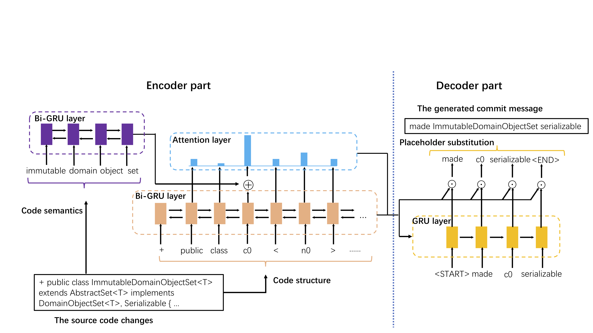

# CoDiSum

Code and data of the paper **Commit Message Generation for Source Code Changes**.

## Intro

CoDiSum is a deep neural network model used to generate commit message for source code changes. It take processed `diff` as input and outputs natural language description.

In this repository, we provide the implementation of our CoDiSum model with Python Keras APIs.

## Requirements

* Python >= 3.6.2
* Numpy >= 1.15.0
* Keras >= 2.1.5
* Tensorflow >= 1.7.0

## Usage

example usage:

```
python CopyNetPlusgen.py
```

This command will lead to a full training and prediction process. Related parameters are in `CopyNetPlusgen.py` file, named in uppercase.

## Datasets

We put the data set in a compressed file `data4CopynetV3.zip`, You can extract directly to the current folder.

## Model



## Citing

If you find CoDiSum useful in your research, we ask that you cite the following paper:

```
@inproceedings{
author = {Xu, Shengbin and Yao, Yuan and Xu, Feng and Gu, Tianxiao and Tong, Hanghang and Lu, Jian},
title = {Commit Message Generation for Source Code Changes},
booktitle = {Proceedings of the 28th International Joint Conference on Artificial Intelligence},
year = {2019},
}
```
